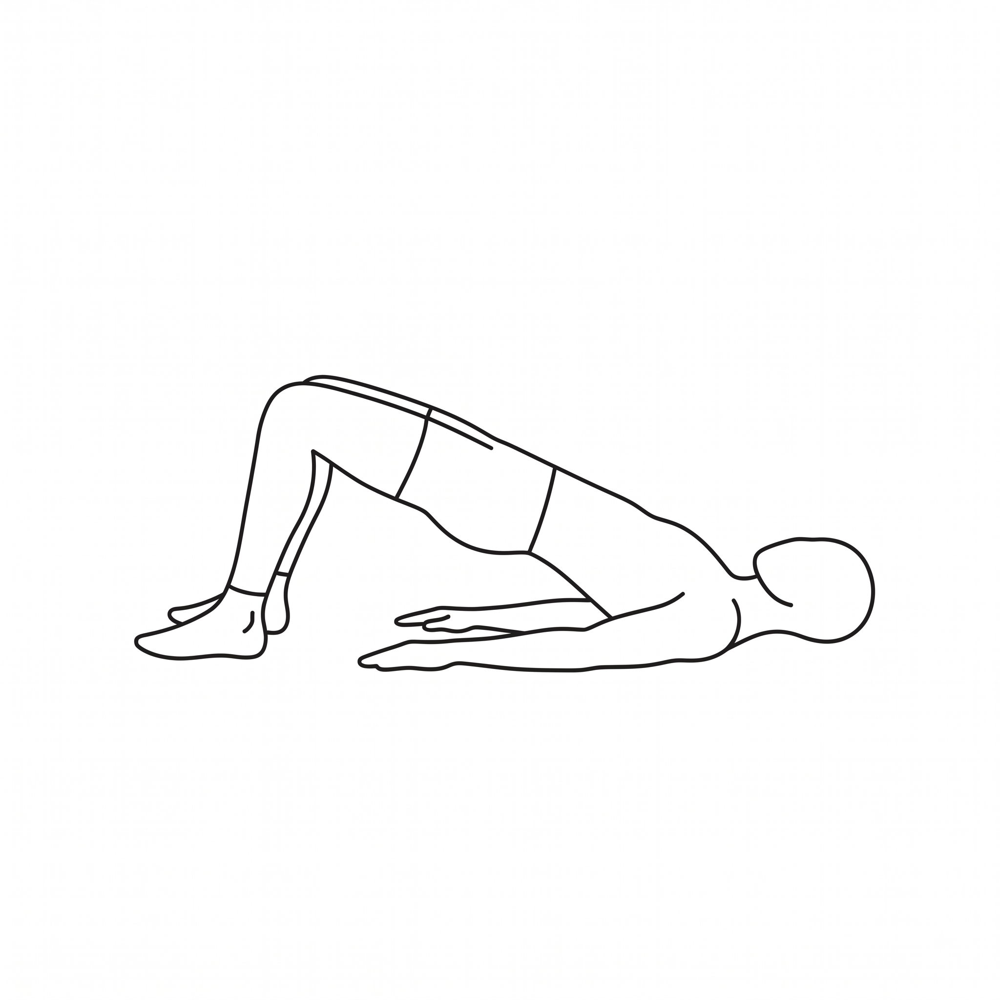

# מאגר תרגילי פיזיותרפיה — Handoff Document

## סטטוס — Production Ready
- ✅ אתר ציבורי (30 תרגילים, עברית, הדפסה) — https://shmulik158-design.github.io/physio-exercises/
- ✅ **עיצוב מלא בוצע על `index.html`** (2026-08-14) — type scale, spacing scale, הדפסה מורחבת, עריכת הוראות פר-הדפסה. פורסם ואומת חי.
- ✅ **`admin.html` עודכן לאותם טוקנים** (2026-08-14) — אותו type scale, spacing scale, רדיוס, ואייקון מותג בכותרת. נבדק מול השרת האמיתי (read-only).
- ✅ כלי ניהול מקומי (הוספה/עריכה/מחיקה/publish) — Node.js, Windows `.bat` launcher.
- ✅ תמונות (512×512px, lazy-loaded)
- ✅ 30 הוראות עברית מלאות
- ✅ תיקונים: atomic writes, commit/push distinction, OneDrive backup, print layout fix

---

## לפני שתזנחו את השיחה — read this

הדוק כתוב בשלושה סעיפים. **ברגע שתסיימו שיחה אחרת**, קלוד הבא **צריך את הדוק הזה** כדי לרדת לפרטים — לא עובדות שקיימות רק בשיחה הקודמת.

---

## חלק 1️⃣ — FRONTEND/DESIGN (עבור `/design`)

### קונפיגורציה קיימת

**RTL**
```html
<html lang="he" dir="rtl">
```
כל layout/spacing חייב לכבד RTL. שימוש עקבי ב-`inset-inline-start`/`padding-inline-start`/`border-inline-start` — לא `left`/`right` hardcoded, כולל אלמנטים חדשים (למשל אייקון החיפוש).

**גופנים** (Google Fonts, כבר טעונים)
- `Frank Ruhl Libre` (כותרות — serif עברי)
- `Assistant` (body — sans-serif עברי)
- `Roboto Mono` (מספרים/מינון/id טכני)

**CSS Tokens** (`:root` ב-`index.html`) — **עודכן**

```css
--paper: #F6F6F1
--paper-raised: #FFFFFF
--ink: #1E2B29
--ink-soft: #5B6C69
--teal: #2B4C4A            (primary)
--teal-dim: #7FA39E
--teal-dark: #1B302E       /* חדש — hover states */
--line: #DAD9CE

/* חדש: type scale (9 רמות) */
--text-2xs: 10.5px   --text-xs: 11.5px   --text-sm: 13px
--text-base: 15px    --text-md: 16px     --text-lg: 17.5px
--text-xl: 21px      --text-2xl: 27px    --text-3xl: 32px

/* חדש: spacing scale, בסיס 8px */
--sp-1: 4px  --sp-2: 8px  --sp-3: 12px  --sp-4: 16px
--sp-5: 24px --sp-6: 32px --sp-7: 48px  --sp-8: 64px

/* חדש: רדיוס */
--radius-sm: 3px   --radius-md: 4px   /* ירד מ-10px — פחות "קלף אפליקציה עגול", יותר נייר קליני */

+ צבע ייעודי לכל 8 אזורי גוף (ללא שינוי):
--shoulder: #C9773F  --cervical: #7C8F6E  --thoracic: #8E7A9C  --lumbar: #B85C6B
--hip: #4D7C8A        --knee: #C9A227      --ankle: #5B8266     --wrist: #9B6B4A
```

**עקרון**: אם מוסיפים טוקנים חדשים — אחדו עם הסקאלה הקיימת (`--sp-*`, `--text-*`), אל תחזרו לערכים אד-הוק.

### שני משטחים נפרדים

**Screen Layout** (`.layout`, `.library`, `.builder`)
- Two-pane: ספריית תרגילים משמאל, builder מימין (RTL)
- Responsive ב-900px
- **חדש**: hover עדין על כרטיסים (`translateY(-1px)` + צל רך), `:focus-visible` גלובלי, `prefers-reduced-motion` guard
- **חדש (2026-08-19) — קיבוץ לפי אזור גוף**: כש-`regionFilter` ריק ("כל האזורים"), הספרייה (וגם רשימת `admin.html`) מוצגת מקובצת לפי `region`, בסדר `REGION_LABELS` (סדר אנטומי קבוע), עם כותרת קבוצה + מונה. כשנבחר אזור ספציפי — רשימה שטוחה כרגיל, בלי כותרות. `#grid`/`#list` הם עכשיו wrapper גמיש; `.card-grid` היא ה-grid בפועל של הכרטיסים בכל קבוצה. **`equipmentFilter`/`listEquipmentFilter` חדש** — "כל הציוד" / "ללא ציוד" (`equipment==='none'`) / "עם ציוד" (כל ערך אחר), קיים בשני המשטחים.

**Print Layout** (`#print-sheet`, ב-`@media print`)
- מוסתר במסך (`display:none`)
- נבנה דינמית ב-JS (`buildPrintSheet()`)
- כותרת + מטא (שם מטופל + תאריך עברי מלא) + רשימת תרגילים ממוספרת + פוטר

**⚠️ Critical**: כל שינוי עיצובי צריך להתייחס לשניהם בנפרד. מה שטוב על מסך לא בהכרח טוב על A4 מודפס.

### Print Sheet Structure — **הורחב**

```css
.p-exercise {
  display: grid;
  grid-template-columns: 32px 120px 1fr;  /* מספר סידורי + thumbnail (הוגדל מ-100px) + טקסט */
  gap: 16px;
  break-inside: avoid;  /* ← אל תבקע תרגיל בין עמודים */
}
```

- `.p-num`: מספר סידורי (1, 2, 3…) — **מידע אמיתי**, לא קישוט: הסדר הוא הסדר שהמטופל מבצע בו את התרגילים
- `.p-thumb`: 120×120px, `object-fit: contain`
- `.p-region`: תג אזור גוף מתחת לשם (חדש — לא היה בהדפסה קודם)
- `.p-dose`: מודגש ב-mono, `tabular-nums`
- `.p-header`: קו תחתון `--teal` 2px, `.p-meta` כולל תאריך הפקה בעברית מלאה ("14 באוגוסט 2026")
- `.p-therapist`: **חדש (2026-08-14)** — שורת ייחוס "דף זה הופק ע"י: {שם}", מודגשת (`font-weight:700`, `color:var(--teal)`) מעל שם המטופל ב-`.p-meta`. ברירת מחדל ריקה. נובע ישירות מהמלצת council session (ראו "החלטות שהתקבלו" בחלק 3️⃣) — הפתרון לבקשת "סימן מים" הייתה שדה ייחוס, לא ווטרמארק גרפי.
- `.p-footer`: כולל ספירת תרגילים בפועל

### HTML Pattern — עודכן

```html
<div class="p-exercise" style="--region-color: var(--hip);">
  <div class="p-num">4</div>
  <div class="p-thumb">
    
  </div>
  <div>
    <h3>הרמות אגן</h3>
    <div class="p-region">ירך</div>
    <div class="p-dose">3 סטים × 12 חזרות</div>
    <div class="p-instructions">טקסט הוראות — עשוי להיות ערוך פר-הדפסה, ראו למטה</div>
  </div>
</div>
```

### חדש: עריכת הוראות ביצוע פר-הדפסה

בכל `.sheet-item` בבילדר יש כעת `<details class="instr-edit">` מתקפל ("עריכת הנחיית ביצוע") עם `<textarea>`:
- ברירת המחדל תמיד `ex.instructions_he` המקורי מהמאגר (עם fallback: `"TODO"` → מוצג כריק, לא מוצג למטפל)
- עריכה משנה **רק את `s.instructions` באובייקט ה-sheet בזיכרון** — לעולם לא נוגעת ב-`EXERCISES` המקורי או ב-`exercises.json`
- נקודה עדינה (●) ליד הכותרת מופיעה רק כשהטקסט שונה מברירת המחדל; כפתור "אפס לברירת מחדל" מחזיר ומעלים אותה
- `buildPrintSheet()` קורא מ-`s.instructions`, לא מ-`s.ex.instructions_he` ישירות

זו התנהגות זהה בעיקרון לשדה "שם המטופל" — state זמני, לא נשמר, לא persisted לשרת. **Backend לא צריך לדעת על זה** (ראו חלק 3️⃣).

### שדה חדש שם: "עצימות" → "הערות מטפל"

שדה המלל החופשי (`intensity-input` ב-code, השם הפנימי לא שונה) עבר relabel שני — היה "עצימות", עבר ל"מלל חופשי", עכשיו **"הערות מטפל — לא חובה"**. השדה עצמו תמיד היה ונשאר free text; זה שינוי label בלבד.

### Containers that hide on print

⚠️ **Important**: כל container שמשמש רק למסך חייב הסתרה מפורשת ב-`@media print`, אחרת תופס מקום כשהוא ריק.

```css
@media print {
  header.app-bar, .layout, .library, .builder {
    display: none !important;  /* כולל .layout! */
  }
}
```

### `admin.html` — עודכן לאותה שפת רכיבים (2026-08-14)

`admin.html` קיבל את אותם טוקנים בדיוק (`--sp-*`, `--text-*`, `--radius-sm/md`, `--teal-dark`) ואת אותו אייקון מותג (גוניומטר) בכותרת. שני הקבצים חולקים עכשיו `:root` כמעט זהה — ההבדלים היחידים הם הטוקנים הסמנטיים הייחודיים ל-admin (`--danger`, `--ok`, לצורך מצבי הצלחה/שגיאה בטופס) שאין להם מקבילה ב-`index.html`.

**נבדק** מול השרת האמיתי הרץ על פורט 8765 (read-only — לא בוצעה שמירה/מחיקה/פרסום בבדיקה): רדיוס, טיפוגרפיה, ואייקון המותג אומתו ב-computed styles.

**מה לא שונה**: כל ה-JS ולוגיקת הטופס (`admin-server.js`, endpoints, validation) — הסבב הזה היה עיצוב בלבד, כמו הסבב הקודם על `index.html`.

---

## חלק 2️⃣ — BACKEND DEVELOPER

**ללא שינוי מהסבב הזה** — כל העיצוב מחדש היה client-side בלבד (`index.html`), ה-API והשרת לא נגעו בהם.

### API Specification

#### GET `/api/data`

**Response:**
```json
{
  "regions": ["shoulder", "cervical", "thoracic", "lumbar", "hip", "knee", "ankle", "wrist"],
  "equipment": ["none", "resistance band", "chair", "wall", "small ball"],
  "exercises": [
    {
      "id": "hip_bridge",
      "name_he": "הרמות אגן",
      "region": "hip",
      "equipment": "none",
      "image_file": "hip_bridge.png",
      "default_sets": "3",
      "default_reps": "12 חזרות",
      "instructions_he": "...",
      "updated_at": "2026-08-19"    // אופציונלי — ראו "Version Tracking" למטה
    }
    // ... 30 כולל
  ]
}
```

#### POST `/api/exercise`

**Request:**
```json
{
  "original_id": "hip_bridge",     // שדה זה מטפל בשינויי id
  "id": "hip_bridge",              // snake_case בלבד: ^[a-z0-9_]+$
  "name_he": "הרמות אגן",
  "region": "hip",                 // חייב במילון
  "equipment": "none",             // חייב במילון
  "default_sets": "3",
  "default_reps": "12 חזרות",      // free text כולל יחידה
  "instructions_he": "...",
  "image_data": "data:image/png;base64,..."  // optional
}
```

**Response (200 OK):**
```json
{
  "ok": true,
  "exercises": [/* כל המאגר המעודכן */]
}
```

**Response (400 Bad Request):**
```json
{
  "ok": false,
  "errors": [
    "מזהה (id) חייב להיות אותיות אנגליות קטנות, ספרות וקו תחתון בלבד",
    "אזור גוף לא חוקי"
  ]
}
```

**Edge Cases:**
- יצירה בלי תמונה → `400` ("חובה לצרף תמונה לתרגיל חדש")
- עריכה + שינוי id + אין תמונה חדשה → העתיקו קובץ תמונה ישן לשם החדש (`fs.renameSync`)
- עריכה + אין תמונה + אין שינוי id → שמרו קובץ קיים
- id חדש כבר קיים → `400` (בדקו רק אם `original_id !== id`)

#### POST `/api/delete`

**Request:**
```json
{ "id": "hip_bridge" }
```

**Response (200 OK):**
```json
{
  "ok": true,
  "exercises": [/* מאגר ללא התרגיל שנמחק */]
}
```

**Side effect**: מחק את קובץ התמונה (`images/{id}.png`).

#### POST `/api/publish`

**Request:** (body ריק)

**Response (200) — Successful:**
```json
{
  "ok": true,
  "message": "פורסם. האתר יתעדכן תוך כדקה."
}
```

**Response (500) — Commit succeeded, push failed:**
```json
{
  "ok": false,
  "errors": [
    "השינוי נשמר במחשב הזה אבל לא עלה לאתר (הדחיפה ל-GitHub נכשלה).",
    "האתר החי עדיין מציג את הגרסה הקודמת. נסה 'פרסם' שוב כשהרשת תחזור.",
    "[git stderr here]"
  ]
}
```

**Response (500) — Commit failed:**
```json
{
  "ok": false,
  "errors": ["הפרסום נכשל:", "[git stderr here]"]
}
```

**⚠️ Critical distinction**: UI חייבת להבחין בין "עבודה נשמרה מקומית, לא עלתה" ל"עבודה אבדה לחלוטין".

---

### Validation Rules

| שדה | Rule | סיבה |
|---|---|---|
| `id` | `^[a-z0-9_]+$` | שם קובץ תמונה בלבד; git-safe |
| `id` | Unique | אין דופליקטים |
| `name_he` | Non-empty (after trim) | חובה |
| `region` | In REGIONS | closed vocabulary |
| `equipment` | In EQUIPMENT | closed vocabulary |

### Image Handling

**Client-side (admin.html):**
- `<canvas>` downscale ל-512 בצד הקטן (MAX = 512)
- Output כ-base64 data URI בבודי POST

**Server-side:**
```javascript
const b64 = body.image_data.replace(/^data:image\/\w+;base64,/, '');
fs.writeFileSync(path.join(IMAGES_DIR, ex.image_file), Buffer.from(b64, 'base64'));
```

**Currently**: אין validation (PNG תקין, 512×512, גודל max). אם צריך — תעדו את ה-reqs.

### Version Tracking — **חדש (2026-08-19)**

`admin-server.js` מוסיף `updated_at` (תאריך ISO, `YYYY-MM-DD`) לכל תרגיל **אוטומטית בכל שמירה** — לא שדה שה-UI שולח, השרת קובע אותו (`new Date().toISOString().slice(0,10)`), גם ביצירה וגם בעריכה. לא ניתן לעריכה ידנית מה-form.

**מוצג ב:**
- `admin.html` — "נערך לאחרונה: {תאריך}" בטופס העריכה, מוסתר כשאין ערך (`updated_at` undefined ברשומות ישנות).
- `index.html` (הספרייה הציבורית) — "עודכן DD.MM.YY" כתווית קטנה על הכרטיס, רק כשקיים.

**החלטת מיגרציה מכוונת**: 30 הרשומות הקיימות **לא קיבלו backfill** לתאריך מזויף — זה היה יוצר רושם שווא שכולן נערכו היום. הן ישארו בלי `updated_at` עד שיישמרו מחדש דרך `admin.html` בפעם הבאה שמישהו עורך אותן.

**מקור**: זיהוי מ-council session (3 מתוך 5 יועצי LLM, ללא תיאום, הצביעו על "content drift בלי גרסתיות" כסיכון) — ראו "החלטות שהתקבלו" למעלה. פותר רק את החלק הזול/מיידי (תג "עודכן"); לא פותר snapshotting מלא של מה בדיוק הודפס למטופל ספציפי — זה עדיין לא בנוי.

### Atomic Writes

```javascript
function writeExercises(list) {
  const tmp = JSON_PATH + '.tmp';
  fs.writeFileSync(tmp, JSON.stringify(list, null, 2) + '\n', 'utf8');
  fs.renameSync(tmp, JSON_PATH);  // atomic at OS level
}
```

קריסה/סגירת חלון = קובץ ישן נשאר שלם, לא JSON חצי-כתוב.

### Git Integration

**Current**: Windows בלבד (`cmd /c start`).

**For future (Mac/Linux):**
- `execFileSync('open', [addr])` for macOS
- `execFileSync('xdg-open', [addr])` for Linux

### Error Handling

קלט מומר תמיד ל-string מפורש:
```javascript
const str = v => (v === null || v === undefined ? '' : String(v)).trim();
```

זה מטפל בטיפוסים לא צפויים (array, object, bool) → תמיד `400` מובן, לא `500`.

---

## חלק 3️⃣ — HANDOFF & COLLABORATION

### Definition of Done

**Frontend/Design:**
- ✅ עיצוב מלא בוצע על `index.html` — type scale, spacing scale, אייקוני SVG, print sheet מורחב
- ✅ אתר מודפס יוצא בצורה מקובלת (A4, ממוספר, readable)
- ✅ RTL תקין (לא flipped text, לא hardcoded left/right)
- ✅ שדות label בעברית, כולל rename "עצימות" → "הערות מטפל"
- ✅ `admin.html` מיושר לאותם טוקנים כמו `index.html`

**Backend:**
- API נבחן בפועל (round-trip CRUD + publish)
- שרת עובד, עלולים להיות edge-case bugs אך skeleton תקין
- לא נדרש שינוי בעקבות סבב העיצוב הזה — התכונה החדשה (עריכת הוראות פר-הדפסה) היא client-side state בלבד

### Collaboration Points

1. **Image Sizing**: Frontend downscale ל-512, Backend קובל bytes בלבד. אם Backend מוסיף validation — תעדו.
2. **Print Design**: Frontend משנה `.p-*` classes. וודאו ש-Backend כותב סכמה תואמת (המבנה עצמו — `id`/`name_he`/`region`/`instructions_he` וכו' — לא השתנה).
3. **Error Messages**: הכל בעברית. Backend כותב, Frontend מציג. עדכנו בתיאום.
4. **חדש — Per-print overrides אינם persisted**: עריכת הוראות ביצוע ושדה "הערות מטפל" הם state זמני בבילדר בלבד (כמו שם מטופל). Backend לא צריך API חדש לזה, ולא אמור לצפות שהם יגיעו ב-`/api/exercise`.

### החלטות שהתקבלו (2026-08-14, בעקבות council session)

לאחר שיחה עם היוזר ומועצת LLM (5 יועצים + peer review, ראו `council-transcript`/`council-report` שנשלחו לצ'אט), התקבלו כמה החלטות מפורשות שכדאי שקלוד/מפתח הבא יכיר — הן **לא derivable מהקוד**, הן החלטות מוצר מודעות:

- **עריכה נשארת מרוכזת אצל הבעלים בלבד.** לא מתוכננת הרחבת הרשאות עריכה לעמיתים כרגע. אם עמית יבקש גישה לעריכה — זו נקודת החלטה מודעת, לא ברירת מחדל. (Executor advisor: "אני עורך, אתה צורך" כתשובה מוכנה מראש.)
- **מאגר אחד משותף לכולם, לא ספרייה אישית פר-מטפל.** הוזכר במפורש כהחלטה — הבעלים חושש שריבוי מאגרים אישיים "יצטבר לדטאבייס עצום, עדיף שיהיה אחד לכולם". זה סוגר את שאלת ה"Fork מול פלטפורמה משותפת" שהמועצה סימנה כהחלטה נדרשת: **נבחר shared, לא fork.**
- **תיקון תוכן = פתרון לאי-שביעות רצון, לא הרשאות.** אם עמית לא אוהב תמונה/ניסוח, הערוץ הוא לפנות לבעלים (email, ראו למטה) — לא לערוך בעצמו. עריכת ההוראות פר-הדפסה (שכבר קיימת) נותנת לו פתרון מיידי ברמת הדף שלו, בלי לגעת בברירת המחדל המשותפת.
- **ערוץ פידבק**: `shmulik158@gmail.com`, מוצג כשורת טקסט קטנה ב-`.builder` (screen-only, מוסתר בהדפסה דרך אותו כלל `@media print` שכבר קיים). לא GitHub Issues — נבחר email מכוון לפשטות.
- **"מונה שימושים" (usage tracking) נדחה לעתיד במפורש.** הרעיון: לראות אילו תרגילים/ניסוחים/וריאציות מועדפים בפועל, כדי לקבל החלטות מושכלות. **הבעיה הארכיטקטונית**: האתר הציבורי סטטי (GitHub Pages) ולא יכול לצבור נתונים בין דפדפנים של מטפלים שונים בלי שרת משותף — זו קפיצה אמיתית מ"סטטי + git" הקיים, לא תוספת קטנה. הוחלט לדחות במודע, לא לבנות infra חדש כרגע.

### Future Paths (Open Decisions)

1. **Image Validation**: האם לאמת PNG בשרת? (כרגע לא)
2. **Responsive Images**: 150 תרגילים — עדיין 512px? או srcset?
3. **OS Support**: Windows כרגע. Mac/Linux?
4. **Accessibility**: audit מלא ל-ARIA/labels? (חלקי — כפתורי אייקון קיבלו `aria-label`, `:focus-visible` גלובלי, `prefers-reduced-motion` guard נוספו בסבב הזה)
5. **Localization**: עברית היום, עברית + אנגלית בעתיד? Architectural impact?
6. **Multi-device editing**: נדחה במפורש — ראו "החלטות שהתקבלו" למעלה. עריכה נשארת single-editor.
7. **Usage tracking / "מונה שימושים"**: נדחה במפורש, דורש backend אמיתי (ראו למעלה). לא לבנות בלי לחזור לזה בכוונה.
8. **Content drift ללא גרסתיות** — **חלקית טופל (2026-08-19)**: תג "עודכן לאחרונה" נוסף (ראו "Version Tracking" בחלק 2️⃣). מה שעדיין לא קיים: snapshot של מה בדיוק הודפס בפועל למטופל ספציפי ברגע נתון — אם התרגיל ישתנה אחרי ההדפסה, אין תיעוד של הגרסה שהמטופל קיבל בפועל. שווה תשומת לב אם ריבוי מטפלים יתרחב.
9. **LICENSE file** — **נוסף (2026-08-19)**: `LICENSE` בשורש הריפו, MIT עבור הקוד בלבד (`index.html`, `admin.html`, `admin-server.js`, `add-exercise.bat`), עם scope note מפורש שהתוכן (`exercises.json`, `images/`) **לא** כלול ונשאר כל הזכויות שמורות. בעל הזכויות בקוד: `shmulik158-design` (משתמש GitHub, לא שם פרטי — בחירת המשתמש).

---

## Files in Repo

**Public:**
- `index.html` (two-pane + print sheet — **עבר עיצוב מחדש מלא, 2026-08-14**)
- `exercises.json` (30 rows)
- `images/` (30 PNG files, 512×512)

**Admin:**
- `admin.html` (form UI, עברית — **עודכן לאותם טוקנים עיצוביים, 2026-08-14**)
- `admin-server.js` (Node.js HTTP server, no deps)
- `add-exercise.bat` (launcher, Windows)

**Documentation:**
- `HANDOFF.md` (הקובץ הזה)
- `.gitignore` (תמונות מקור excluded)
- GitHub Pages deployment (automatic on push, ~40s build)

---

## How to Hand Off to Next Developer

1. **Designer**: Send them part 1️⃣. They work in `/design`.
2. **Backend Dev**: Send them part 2️⃣. They maintain/expand API + tests.
3. **Both**: Reference part 3️⃣ when collaborating on image sizing, print, errors, or future decisions.

**No confusion. Clear boundaries. Done.**
